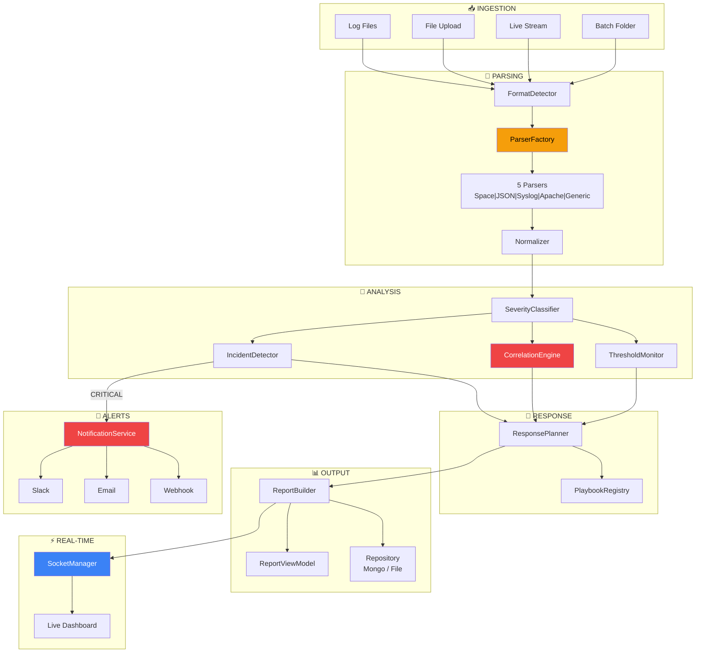
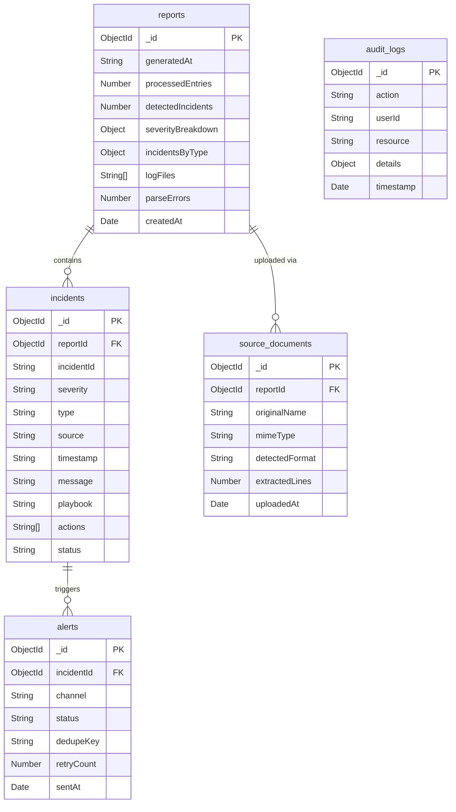
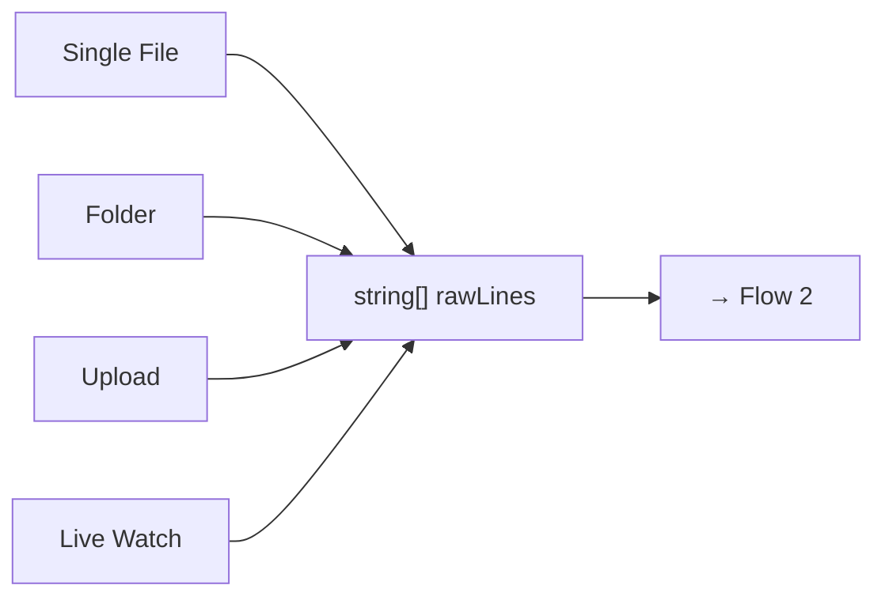
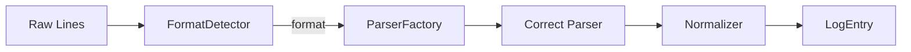

# 🔍 AUTOMATED LOG ANALYSIS & INCIDENT RESPONSE SYSTEM
# ═══════════════════════════════════════════════════════
# THE FINAL ROADMAP — Follow This Exactly
# ═══════════════════════════════════════════════════════

> **This is your ONE and ONLY reference document.**
> Part 1 covers: Structure, Architecture, Tech Stack, DB, and Flows 1–6.
> Part 2 covers: Flows 7–12, Hidden SDE Flows, File Connection Map, and Day-by-Day Build Checklist.

---

## 1. WHAT WE ARE BUILDING

A production-grade observability & incident response platform that:

| # | Capability | How |
|---|-----------|-----|
| 1 | **Ingests** logs from files, uploads, folders, live streams | LogReader, BatchIngester, StreamIngester, Multer |
| 2 | **Parses** ANY log format automatically | ParserFactory → 5 strategy parsers |
| 3 | **Normalizes** all formats into one unified schema | Normalizer |
| 4 | **Classifies** severity (LOW/MEDIUM/HIGH/CRITICAL) | Rules + keywords + frequency scoring |
| 5 | **Detects** incidents (single + multi-log correlation) | IncidentDetector + CorrelationEngine + ThresholdMonitor |
| 6 | **Recommends** response playbooks | ResponsePlanner + PlaybookRegistry |
| 7 | **Generates** reports with metrics | ReportBuilder + ReportExporter (PDF/CSV) |
| 8 | **Persists** to MongoDB (hot) + JSON (cold fallback) | Repository Pattern |
| 9 | **Alerts** via Slack / Email / Webhook | NotificationService with dedup + escalation |
| 10 | **Streams** real-time updates to dashboard | Socket.io WebSocket |
| 11 | **Processes** large files via background queues | BullMQ + Redis |
| 12 | **Audits** every action + RBAC access control | Audit middleware + JWT + roles |

---

## 2. COMPLETE FOLDER STRUCTURE

```
log-analyzer/
│
├── 📁 server/                                    # ALL BACKEND CODE
│   ├── package.json
│   ├── .env                                      # Environment variables
│   ├── .env.example                              # Template
│   │
│   ├── 📁 src/
│   │   ├── server.js                             # 🚀 ENTRY: starts HTTP + WebSocket
│   │   ├── app.js                                # Express factory (DI wiring center)
│   │   │
│   │   ├── 📁 config/
│   │   │   ├── env.js                            # Loads .env → config object
│   │   │   ├── rules.js                          # Severity rules + incident keywords
│   │   │   ├── playbooks.js                      # Response playbook definitions
│   │   │   ├── parserFormats.js                  # Log format detection patterns
│   │   │   └── alertChannels.js                  # Slack/Email/Webhook configs
│   │   │
│   │   ├── 📁 models/
│   │   │   ├── LogEntry.js                       # Parsed log line shape
│   │   │   ├── IncidentRecord.js                 # Detected incident shape
│   │   │   ├── Report.js                         # Report object shape
│   │   │   ├── AlertEvent.js                     # Notification event shape
│   │   │   └── AuditLog.js                       # Audit trail entry shape
│   │   │
│   │   ├── 📁 services/
│   │   │   │
│   │   │   ├── 📁 ingestion/                     # FLOW 1
│   │   │   │   ├── LogReader.js                  #   Read single .log from disk
│   │   │   │   ├── BatchIngester.js              #   Read all .log files in a folder
│   │   │   │   └── StreamIngester.js             #   Watch files for new lines (chokidar)
│   │   │   │
│   │   │   ├── 📁 parsing/                       # FLOW 2
│   │   │   │   ├── ParserFactory.js              #   Format → correct parser
│   │   │   │   ├── FormatDetector.js             #   Identifies format from sample lines
│   │   │   │   ├── Normalizer.js                 #   Unified output schema
│   │   │   │   └── 📁 parsers/                   #   One parser per format (Strategy)
│   │   │   │       ├── SpaceDelimitedParser.js   #     "2026-04-06 09:00 ERROR auth msg"
│   │   │   │       ├── JsonLogParser.js          #     {"timestamp":"...","level":"ERROR"}
│   │   │   │       ├── SyslogParser.js           #     "<34>1 2026-04-06T09:00Z host app"
│   │   │   │       ├── ApacheParser.js           #     Apache/Nginx combined format
│   │   │   │       └── GenericParser.js          #     Fallback for unknown formats
│   │   │   │
│   │   │   ├── 📁 analysis/                      # FLOWS 3-4
│   │   │   │   ├── SeverityClassifier.js         #   Rules + keywords + freq → severity
│   │   │   │   ├── IncidentDetector.js           #   Single-log anomaly detection
│   │   │   │   ├── CorrelationEngine.js          #   Multi-log pattern detection
│   │   │   │   └── ThresholdMonitor.js           #   Count-based threshold breach
│   │   │   │
│   │   │   ├── 📁 response/                      # FLOW 5
│   │   │   │   ├── ResponsePlanner.js            #   Maps incident → playbook
│   │   │   │   └── PlaybookRegistry.js           #   Manages playbook definitions
│   │   │   │
│   │   │   ├── 📁 reporting/                     # FLOW 6
│   │   │   │   ├── ReportBuilder.js              #   Aggregates → Report JSON
│   │   │   │   ├── ReportViewModel.js            #   Transforms → dashboard view
│   │   │   │   └── ReportExporter.js             #   Export PDF / CSV
│   │   │   │
│   │   │   ├── 📁 notification/                  # FLOW 12
│   │   │   │   ├── NotificationService.js        #   Orchestrates alert delivery
│   │   │   │   ├── AlertDeduplicator.js          #   Prevents duplicate alerts
│   │   │   │   ├── EscalationPolicy.js           #   Time-based escalation
│   │   │   │   └── 📁 channels/                  #   Strategy: one per channel
│   │   │   │       ├── SlackChannel.js
│   │   │   │       ├── EmailChannel.js
│   │   │   │       └── WebhookChannel.js
│   │   │   │
│   │   │   ├── 📁 realtime/                      # FLOW 11
│   │   │   │   ├── SocketManager.js              #   Socket.io server + rooms
│   │   │   │   ├── LiveAnalyzer.js               #   Pipeline on live lines
│   │   │   │   └── EventEmitterBridge.js         #   Analysis events → WebSocket
│   │   │   │
│   │   │   ├── PdfService.js                     # FLOW 10: PDF text extraction
│   │   │   ├── ValidationService.js              # Input validation helpers
│   │   │   ├── AnalysisEngine.js                 # PIPELINE: chains parse→classify→detect→plan
│   │   │   └── IncidentOrchestrator.js           # TOP-LEVEL: full workflow coordinator
│   │   │
│   │   ├── 📁 repositories/                      # FLOW 7
│   │   │   ├── MongoRepository.js                #   MongoDB CRUD
│   │   │   ├── FileRepository.js                 #   JSON file fallback
│   │   │   └── AuditRepository.js                #   Audit log storage
│   │   │
│   │   ├── 📁 db/
│   │   │   └── mongo.js                          #   MongoDB connection manager
│   │   │
│   │   ├── 📁 queues/                            # Background jobs (BullMQ)
│   │   │   ├── queueManager.js                   #   Queue setup (Redis)
│   │   │   ├── jobs.js                           #   Job type definitions
│   │   │   └── 📁 processors/
│   │   │       ├── analysisProcessor.js          #   Async analysis worker
│   │   │       └── notificationProcessor.js      #   Async notification worker
│   │   │
│   │   ├── 📁 controllers/                       # FLOW 8
│   │   │   ├── analysisController.js
│   │   │   ├── reportController.js
│   │   │   ├── uploadController.js
│   │   │   └── realtimeController.js
│   │   │
│   │   ├── 📁 routes/
│   │   │   ├── index.js                          #   Combines all route files
│   │   │   ├── analysisRoutes.js
│   │   │   ├── reportRoutes.js
│   │   │   └── uploadRoutes.js
│   │   │
│   │   ├── 📁 middleware/
│   │   │   ├── errorHandler.js                   #   Global error catcher
│   │   │   ├── upload.js                         #   Multer config
│   │   │   ├── validate.js                       #   Request validation
│   │   │   ├── auth.js                           #   JWT authentication
│   │   │   ├── rbac.js                           #   Role-based access
│   │   │   ├── rateLimiter.js                    #   API rate limiting
│   │   │   └── audit.js                          #   Audit trail logging
│   │   │
│   │   ├── 📁 cli/
│   │   │   ├── runCli.js                         #   CLI entry point
│   │   │   └── CommandLineUI.js                  #   Interactive menu
│   │   │
│   │   └── 📁 utils/
│   │       ├── logger.js                         #   Structured logging (Winston)
│   │       ├── retry.js                          #   Retry with exponential backoff
│   │       ├── errors.js                         #   Custom error classes
│   │       └── idGenerator.js                    #   INC-001 style IDs
│   │
│   └── 📁 tests/
│       ├── 📁 unit/
│       │   ├── 📁 parsers/
│       │   │   ├── ParserFactory.test.js
│       │   │   ├── FormatDetector.test.js
│       │   │   ├── SpaceDelimitedParser.test.js
│       │   │   ├── JsonLogParser.test.js
│       │   │   └── SyslogParser.test.js
│       │   ├── SeverityClassifier.test.js
│       │   ├── IncidentDetector.test.js
│       │   ├── CorrelationEngine.test.js
│       │   ├── ResponsePlanner.test.js
│       │   ├── AnalysisEngine.test.js
│       │   ├── NotificationService.test.js
│       │   └── IncidentOrchestrator.test.js
│       └── 📁 integration/
│           ├── api.test.js
│           ├── upload.test.js
│           └── websocket.test.js
│
├── 📁 client/                                     # ALL FRONTEND CODE
│   ├── package.json
│   ├── index.html
│   ├── vite.config.js
│   └── 📁 src/
│       ├── main.jsx                               # 🚀 ENTRY: mount React
│       ├── App.jsx                                # Root + providers
│       ├── 📁 styles/
│       │   └── global.css                         # Complete design system
│       ├── 📁 services/
│       │   ├── apiClient.js                       # Axios instance
│       │   ├── incidentApi.js                     # Analysis/report calls
│       │   ├── uploadApi.js                       # Upload calls
│       │   └── socketClient.js                    # Socket.io client
│       ├── 📁 hooks/
│       │   ├── useDashboard.js                    # Dashboard state + logic
│       │   ├── useRealtime.js                     # WebSocket subscription
│       │   └── useFileUpload.js                   # Upload state + drag-drop
│       ├── 📁 pages/
│       │   ├── DashboardPage.jsx
│       │   ├── LiveMonitorPage.jsx
│       │   ├── UploadPage.jsx
│       │   └── ReportPage.jsx
│       ├── 📁 components/
│       │   ├── Layout.jsx                         # Shell (header+sidebar+content)
│       │   ├── SummaryCards.jsx                    # Metric cards
│       │   ├── SeverityChart.jsx                  # Severity pie/bar chart
│       │   ├── IncidentTimeline.jsx               # Timeline visualization
│       │   ├── IncidentList.jsx                   # Filterable incident table
│       │   ├── IncidentDetail.jsx                 # Expanded incident + playbook
│       │   ├── FileList.jsx                       # Analyzed files list
│       │   ├── UploadZone.jsx                     # Drag-and-drop upload
│       │   ├── ActionBar.jsx                      # Run/Load/Export buttons
│       │   ├── LiveLogStream.jsx                  # Real-time log ticker
│       │   ├── AlertBanner.jsx                    # Critical alert popup
│       │   └── LoadingSpinner.jsx
│       └── 📁 routes/
│           └── AppRoutes.jsx
│
├── 📁 logs/                                        # Sample logs (all formats)
│   ├── application.log                            # Space-delimited
│   ├── security.log                               # Space-delimited
│   ├── system.log                                 # Space-delimited
│   ├── api-access.log                             # Apache format
│   ├── microservice.json.log                      # JSON format
│   └── syslog.log                                 # Syslog format
│
├── 📁 shared/
│   └── constants.js
│
├── docker-compose.yml                              # MongoDB + Redis + App
├── .gitignore
└── README.md
```

---

## 3. MASTER ARCHITECTURE



**Plain English Flow:**
```
Logs come in → Detect format → Pick parser → Parse → Normalize
→ Classify severity → Detect incidents (single + multi-log + threshold)
→ Assign playbook → Build report → Save to DB
→ Alert on CRITICAL → Stream to dashboard in real-time
```

---

## 4. TECHNOLOGY STACK

| Layer | Technology | Purpose |
|-------|-----------|---------|
| **Runtime** | Node.js 20+ | Server |
| **API** | Express 4 | REST endpoints |
| **Real-Time** | Socket.io | WebSocket live updates |
| **Queue** | BullMQ + Redis | Background job processing |
| **Database** | MongoDB (native driver) | Primary store |
| **PDF** | pdf-parse | Extract text from PDFs |
| **Upload** | Multer | Multipart file handling |
| **Logging** | Winston | Structured app logging |
| **Auth** | jsonwebtoken + bcrypt | JWT + password hashing |
| **Email** | Nodemailer | Email alerts |
| **File Watch** | chokidar | Live log monitoring |
| **Testing** | Jest + Supertest | Unit + integration |
| **Frontend** | React 18 + Vite 5 | SPA dashboard |
| **Charts** | Recharts | Data visualization |
| **HTTP Client** | Axios | API calls |
| **Container** | Docker Compose | MongoDB + Redis + App |

---

## 5. DATABASE SCHEMA



---

## 6. DOCKER COMPOSE

```yaml
version: '3.8'
services:
  mongodb:
    image: mongo:7
    ports: ["27017:27017"]
    volumes: [mongo-data:/data/db]
    environment:
      MONGO_INITDB_DATABASE: log_analyzer

  redis:
    image: redis:7-alpine
    ports: ["6379:6379"]

  server:
    build: ./server
    ports: ["3001:3001"]
    environment:
      PORT: 3001
      MONGO_URI: mongodb://mongodb:27017/log_analyzer
      REDIS_URL: redis://redis:6379
    depends_on: [mongodb, redis]
    volumes: [./logs:/app/logs]

  client:
    build: ./client
    ports: ["5173:5173"]
    depends_on: [server]

volumes:
  mongo-data:
```

---

## 7. SAMPLE LOG FILES

### `logs/application.log` (Space-Delimited)
```
2026-04-06 09:00:00 INFO system Service started successfully
2026-04-06 09:00:05 INFO auth-service User admin logged in
2026-04-06 09:01:12 WARNING api-gateway Request rate approaching limit
2026-04-06 09:02:30 ERROR auth-service Login failed for user admin from 192.168.1.50
2026-04-06 09:02:31 ERROR auth-service Login failed for user admin from 192.168.1.50
2026-04-06 09:02:32 ERROR auth-service Login failed for user admin from 192.168.1.50
2026-04-06 09:02:33 ERROR auth-service Login failed for user admin from 192.168.1.50
2026-04-06 09:02:34 ERROR auth-service Login failed for user admin from 192.168.1.50
2026-04-06 09:03:00 ERROR security Unauthorized access attempt from 10.0.0.55
2026-04-06 09:05:00 WARNING db-service Connection pool near exhaustion
2026-04-06 09:06:00 ERROR payment-service Transaction timeout after 30s
2026-04-06 09:07:00 INFO scheduler Backup job completed
```

### `logs/microservice.json.log` (JSON)
```
{"timestamp":"2026-04-06T09:00:00Z","level":"info","service":"user-service","msg":"Health check passed"}
{"timestamp":"2026-04-06T09:01:00Z","level":"error","service":"order-service","msg":"Database connection refused"}
{"timestamp":"2026-04-06T09:02:00Z","level":"warn","service":"inventory-service","msg":"Cache miss rate above 80%"}
{"timestamp":"2026-04-06T09:03:00Z","level":"error","service":"payment-service","msg":"Stripe API timeout"}
```

### `logs/syslog.log` (Syslog)
```
<34>1 2026-04-06T09:00:00Z webserver01 nginx 1234 - GET /api/health 200 12ms
<27>1 2026-04-06T09:01:00Z dbserver01 postgresql 5678 - FATAL: too many connections
<28>1 2026-04-06T09:02:00Z authserver01 sshd 9012 - Failed password for root from 203.0.113.1
```

### `logs/api-access.log` (Apache)
```
192.168.1.100 - admin [06/Apr/2026:09:00:00 +0000] "GET /api/users HTTP/1.1" 200 1234
192.168.1.101 - - [06/Apr/2026:09:01:00 +0000] "POST /api/login HTTP/1.1" 401 89
10.0.0.55 - - [06/Apr/2026:09:02:00 +0000] "GET /admin/config HTTP/1.1" 403 0
```

---

## 8. ALL 12 FLOWS — COMPLETE LOW-LEVEL DESIGN

---

### FLOW 1: 📥 LOG INGESTION

**Purpose:** Get raw log data INTO the system from any source.

**Files:** `services/ingestion/LogReader.js`, `BatchIngester.js`, `StreamIngester.js`



**LogReader.js:**
```
class LogReader:
  readFile(filePath):
    if !fs.existsSync(filePath): throw FileNotFoundError(filePath)
    content = fs.readFileSync(filePath, 'utf-8')
    lines = content.split('\n').filter(line => line.trim() !== '')
    return { filePath, lines, lineCount: lines.length }
```

**BatchIngester.js:**
```
class BatchIngester:
  constructor(logReader)
  ingestFolder(folderPath):
    files = fs.readdirSync(folderPath).filter(f => f.endsWith('.log'))
    if files.length === 0: throw NoLogFilesError(folderPath)
    return files.map(f => this.logReader.readFile(path.join(folderPath, f)))
```

**StreamIngester.js:**
```
class StreamIngester extends EventEmitter:
  constructor(logReader)
  watch(folderPath):
    watcher = chokidar.watch(folderPath + '/*.log')
    fileSizes = {}
    watcher.on('change', (filePath) => {
      currentSize = fs.statSync(filePath).size
      prevSize = fileSizes[filePath] || 0
      if currentSize > prevSize:
        // Read ONLY new bytes
        buffer = Buffer.alloc(currentSize - prevSize)
        fd = fs.openSync(filePath, 'r')
        fs.readSync(fd, buffer, 0, buffer.length, prevSize)
        fs.closeSync(fd)
        newLines = buffer.toString('utf-8').split('\n').filter(Boolean)
        fileSizes[filePath] = currentSize
        this.emit('newLines', { filePath, lines: newLines })
    })
    return watcher
  stop(watcher): watcher.close()
```

---

### FLOW 2: 🧹 PARSING & NORMALIZATION (ParserFactory)

**Purpose:** Auto-detect format → pick parser → parse → normalize to unified schema.

**Files:** `FormatDetector.js`, `ParserFactory.js`, `Normalizer.js`, `parsers/*.js`



**config/parserFormats.js:**
```
module.exports = {
  patterns: {
    json:      { test: (line) => { try { JSON.parse(line); return true } catch { return false } } },
    syslog:    { test: (line) => /^<\d+>/.test(line) },
    apache:    { test: (line) => /^\d+\.\d+\.\d+\.\d+\s+-\s+-?\s*\[/.test(line) },
    spaceDelimited: { test: (line) => /^\d{4}-\d{2}-\d{2}\s+\d{2}:\d{2}:\d{2}\s+\w+\s+\w+/.test(line) }
  },
  detectionOrder: ['json', 'syslog', 'apache', 'spaceDelimited']
}
```

**FormatDetector.js:**
```
class FormatDetector:
  constructor(formatConfig)
  detect(sampleLines):
    samples = sampleLines.slice(0, 5).filter(Boolean)
    if samples.length === 0: return 'generic'
    for format of this.formatConfig.detectionOrder:
      matchCount = samples.filter(l => this.formatConfig.patterns[format].test(l)).length
      if matchCount / samples.length > 0.6: return format
    return 'generic'
```

**ParserFactory.js:**
```
class ParserFactory:
  constructor():
    this.parsers = {
      spaceDelimited: new SpaceDelimitedParser(),
      json: new JsonLogParser(),
      syslog: new SyslogParser(),
      apache: new ApacheParser(),
      generic: new GenericParser()
    }
  getParser(format): return this.parsers[format] || this.parsers.generic
```

**SpaceDelimitedParser.js:** `"2026-04-06 09:00:00 ERROR auth Login failed"`
```
parse(line):
  tokens = line.trim().split(/\s+/)
  if tokens.length < 5: return null
  return { timestamp: tokens[0]+' '+tokens[1], level: tokens[2].toUpperCase(),
           source: tokens[3], message: tokens.slice(4).join(' '), rawLine: line }
```

**JsonLogParser.js:** `{"timestamp":"...","level":"error","service":"auth","msg":"..."}`
```
parse(line):
  try:
    obj = JSON.parse(line)
    return { timestamp: obj.timestamp||obj.time||'unknown',
             level: (obj.level||'INFO').toUpperCase(),
             source: obj.service||obj.source||'unknown',
             message: obj.message||obj.msg||'', rawLine: line, metadata: obj }
  catch: return null
```

**SyslogParser.js:** `"<34>1 2026-04-06T09:00:00Z host app pid - msg"`
```
parse(line):
  match = line.match(/^<(\d+)>\d?\s*(\S+)\s+(\S+)\s+(\S+)\s+(\S+)\s+(.*)/)
  if !match: return null
  priority = parseInt(match[1])
  return { timestamp: match[2], level: this.priorityToLevel(priority % 8),
           source: match[4], message: match[6], rawLine: line,
           metadata: { facility: Math.floor(priority/8), host: match[3] } }
```

**ApacheParser.js:** `"192.168.1.1 - admin [06/Apr/2026:09:00:00] "GET /api" 200 1234"`
```
parse(line):
  match = line.match(/^(\S+)\s+\S+\s+(\S+)\s+\[([^\]]+)\]\s+"(\S+)\s+(\S+)[^"]*"\s+(\d+)\s+(\d+)/)
  if !match: return null
  status = parseInt(match[6])
  level = status >= 500 ? 'ERROR' : status >= 400 ? 'WARNING' : 'INFO'
  return { timestamp: match[3], level, source: 'http',
           message: `${match[4]} ${match[5]} → ${status}`, rawLine: line,
           metadata: { ip: match[1], user: match[2], method: match[4], path: match[5], status, bytes: match[7] } }
```

**Normalizer.js:**
```
class Normalizer:
  normalize(parsed):
    if !parsed: return null
    return { timestamp: parsed.timestamp || new Date().toISOString(),
             level: this.normalizeLevel(parsed.level),
             source: parsed.source || 'unknown',
             message: parsed.message || '', rawLine: parsed.rawLine || '',
             metadata: parsed.metadata || {}, parsedAt: new Date().toISOString() }
  normalizeLevel(level):
    aliases = { FATAL:'CRITICAL', SEVERE:'CRITICAL', WARN:'WARNING', ERR:'ERROR' }
    return aliases[(level||'INFO').toUpperCase()] || (level||'INFO').toUpperCase()
```

---

### FLOW 3: 🏷️ SEVERITY CLASSIFICATION

**Purpose:** Score each entry → LOW / MEDIUM / HIGH / CRITICAL.

**Files:** `services/analysis/SeverityClassifier.js`, `config/rules.js`

**config/rules.js:**
```
module.exports = {
  severityMap: {
    CRITICAL:'CRITICAL', FATAL:'CRITICAL', ERROR:'HIGH', WARNING:'MEDIUM',
    INFO:'LOW', DEBUG:'LOW', TRACE:'LOW'
  },
  keywordWeights: {
    'unauthorized':3, 'breach':3, 'attack':3, 'exploit':3, 'injection':3, 'malware':3,
    'failed':2, 'denied':2, 'suspicious':2, 'crash':2, 'overflow':2, 'outage':2,
    'timeout':1, 'retry':1, 'degraded':1
  },
  frequencyRules: { windowSeconds: 120,
    thresholds: [{ count:20, boost:3 }, { count:10, boost:2 }, { count:5, boost:1 }]
  },
  incidentKeywords: ['unauthorized','timeout','suspicious','failed','crash',
    'denied','breach','attack','exploit','overflow','injection','malware','intrusion']
}
```

**SeverityClassifier.js:**
```
class SeverityClassifier:
  constructor(rules):
    this.levelMap = rules.severityMap
    this.keywords = rules.keywordWeights
    this.recentEvents = {}  // for frequency tracking

  classify(entry):
    // Score 1: Base level
    base = { CRITICAL:8, ERROR:5, WARNING:3, INFO:1, DEBUG:0 }[entry.level] || 1

    // Score 2: Keyword matching
    kwScore = 0
    msg = entry.message.toLowerCase()
    for [kw, weight] of Object.entries(this.keywords):
      if msg.includes(kw): kwScore += weight

    // Score 3: Frequency boost
    key = `${entry.source}:${entry.level}`
    this.recentEvents[key] = (this.recentEvents[key] || 0) + 1
    freqBoost = this.recentEvents[key] >= 20 ? 3 : this.recentEvents[key] >= 10 ? 2 :
                this.recentEvents[key] >= 5 ? 1 : 0

    total = base + kwScore + freqBoost
    if total >= 8: return 'CRITICAL'
    if total >= 5: return 'HIGH'
    if total >= 3: return 'MEDIUM'
    return 'LOW'
```

---

### FLOW 4: 🚨 INCIDENT DETECTION (Single + Correlation + Threshold)

**Purpose:** Is this entry (or pattern) a real incident?

**Files:** `IncidentDetector.js`, `CorrelationEngine.js`, `ThresholdMonitor.js`

**IncidentDetector.js (Single-Log):**
```
class IncidentDetector:
  constructor(rules)
  isIncident(entry):
    if entry.severity === 'HIGH' || entry.severity === 'CRITICAL':
      return { isIncident: true, reason: 'High severity', type: 'severity-trigger' }
    msg = entry.message.toLowerCase()
    for kw of this.rules.incidentKeywords:
      if msg.includes(kw):
        return { isIncident: true, reason: `Keyword: ${kw}`, type: 'keyword-trigger' }
    return { isIncident: false }
```

**CorrelationEngine.js (Multi-Log — THE SDE UPGRADE):**
```
class CorrelationEngine:
  constructor():
    this.windows = {}
    this.rules = [
      { name:'brute-force', match: e => e.message.toLowerCase().includes('login failed'),
        windowMs: 120000, threshold: 5, type: 'brute-force-attack', severity: 'CRITICAL' },
      { name:'cascade', match: e => e.level === 'ERROR',
        windowMs: 60000, threshold: 3, groupBy: 'source', type: 'cascade-failure', severity: 'CRITICAL' },
      { name:'timeout-storm', match: e => e.message.toLowerCase().includes('timeout'),
        windowMs: 300000, threshold: 10, type: 'service-degradation', severity: 'HIGH' }
    ]

  analyze(entry):
    detected = []
    now = Date.now()
    for rule of this.rules:
      if !rule.match(entry): continue
      key = rule.name + ':' + (rule.groupBy ? 'multi' : entry.source)
      if !this.windows[key]: this.windows[key] = { events: [], sources: new Set() }
      win = this.windows[key]
      win.events.push({ ts: now, source: entry.source })
      win.sources.add(entry.source)
      win.events = win.events.filter(e => now - e.ts < rule.windowMs)
      count = rule.groupBy === 'source' ? win.sources.size : win.events.length
      if count >= rule.threshold:
        detected.push({ type: rule.type, severity: rule.severity, eventCount: count, triggerEntry: entry })
        this.windows[key] = { events: [], sources: new Set() }
    return detected
```

**ThresholdMonitor.js:**
```
class ThresholdMonitor:
  constructor(): this.counters = {}
  track(entry):
    key = `${entry.level}:${entry.source}`
    this.counters[key] = (this.counters[key] || 0) + 1
  checkThresholds():
    breaches = []
    for [key, count] of Object.entries(this.counters):
      if count >= 50: breaches.push({ key, count, severity:'CRITICAL', type:'threshold-breach' })
      else if count >= 20: breaches.push({ key, count, severity:'HIGH', type:'threshold-breach' })
    return breaches
  reset(): this.counters = {}
```

---

### FLOW 5: 📚 PLAYBOOK RECOMMENDATION

**Purpose:** Map incident → playbook with action steps.

**Files:** `ResponsePlanner.js`, `PlaybookRegistry.js`, `config/playbooks.js`

**config/playbooks.js:**
```
module.exports = {
  'security-containment': {
    priority:'P1', estimatedMinutes:15,
    actions: ['Isolate affected systems','Block source IPs','Revoke credentials',
              'Capture forensic snapshots','Review audit logs','Notify security lead']
  },
  'cascade-recovery': {
    priority:'P1', estimatedMinutes:20,
    actions: ['Identify root service','Check shared dependencies','Restart in order',
              'Enable circuit breakers','Scale up healthy instances','Monitor 30min']
  },
  'service-recovery': {
    priority:'P2', estimatedMinutes:30,
    actions: ['Check health endpoints','Review recent deployments','Restart services',
              'Check CPU/memory/disk','Enable verbose logging','Create post-mortem ticket']
  },
  'performance-remediation': {
    priority:'P3', estimatedMinutes:45,
    actions: ['Check network latency','Review DB queries','Check connection pools',
              'Scale up resources','Add caching','Setup performance alerts']
  },
  'manual-triage': {
    priority:'P4', estimatedMinutes:60,
    actions: ['Assign to on-call','Gather context','Determine root cause','Escalate if unresolved']
  }
}
```

**PlaybookRegistry.js:**
```
class PlaybookRegistry:
  constructor(config): this.playbooks = config
  get(name): return this.playbooks[name] || this.playbooks['manual-triage']
```

**ResponsePlanner.js:**
```
class ResponsePlanner:
  constructor(registry): this.registry = registry
  plan(incident):
    name = this.selectPlaybook(incident)
    pb = this.registry.get(name)
    incident.playbook = name
    incident.actions = pb.actions
    incident.priority = pb.priority
    return incident
  selectPlaybook(inc):
    type = inc.type || ''
    msg = (inc.message || '').toLowerCase()
    if type === 'brute-force-attack' || msg.includes('unauthorized'): return 'security-containment'
    if type === 'cascade-failure': return 'cascade-recovery'
    if type === 'severity-trigger' || msg.includes('failed') || msg.includes('crash'): return 'service-recovery'
    if type === 'service-degradation' || msg.includes('timeout'): return 'performance-remediation'
    return 'manual-triage'
```

---

### FLOW 6: 📊 REPORT GENERATION

**Purpose:** Aggregate all results → Report JSON + dashboard view.

**Files:** `ReportBuilder.js`, `ReportViewModel.js`, `ReportExporter.js`

**ReportBuilder.js:**
```
class ReportBuilder:
  build({ entries, incidents, parseErrors, files, fileFormats }):
    sevBreakdown = { CRITICAL:0, HIGH:0, MEDIUM:0, LOW:0 }
    entries.forEach(e => sevBreakdown[e.severity]++)
    incByType = {}
    incidents.forEach(i => incByType[i.type] = (incByType[i.type]||0)+1)
    return {
      generatedAt: new Date().toISOString(),
      processedEntries: entries.length,
      detectedIncidents: incidents.length,
      severityBreakdown: sevBreakdown,
      incidentsByType: incByType,
      incidents, logFiles: files, parseErrors,
      formatDistribution: fileFormats || {},
      metrics: {
        incidentRate: (incidents.length/entries.length*100).toFixed(2)+'%',
        criticalCount: sevBreakdown.CRITICAL
      }
    }
```

**ReportViewModel.js:**
```
class ReportViewModel:
  toDashboardView(report):
    return {
      summary: { total: report.processedEntries, incidents: report.detectedIncidents,
                 critical: report.severityBreakdown.CRITICAL, high: report.severityBreakdown.HIGH,
                 medium: report.severityBreakdown.MEDIUM, low: report.severityBreakdown.LOW,
                 incidentRate: report.metrics.incidentRate },
      severityChart: report.severityBreakdown,
      incidentTypeChart: report.incidentsByType,
      incidents: report.incidents.map(i => ({
        id:i.id, severity:i.severity, type:i.type, source:i.source,
        message:i.message, playbook:i.playbook, actionCount:i.actions.length,
        timestamp:i.timestamp, status:i.status })),
      analyzedFiles: report.logFiles,
      generatedAt: report.generatedAt
    }
```

---

> **Continue to Part 2 →** [final_roadmap_part2.md](file:///C:/Users/jadon/.gemini/antigravity/brain/c34b8c01-f0c5-4daa-88a0-acff2c6d0250/final_roadmap_part2.md)
> Covers: Flows 7-12, Hidden SDE Flows, AnalysisEngine + Orchestrator, File Connection Map, Day-by-Day Checklist
