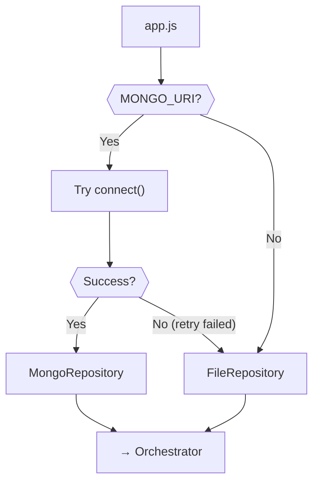
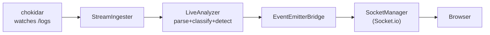

# 🔍 THE FINAL ROADMAP — Part 2 of 2
# Flows 7–12 + SDE Flows + Pipeline Glue + Connection Map + Build Checklist

---

## FLOW 7: 💾 PERSISTENCE (Repository Pattern)

**Files:** `repositories/MongoRepository.js`, `FileRepository.js`, `db/mongo.js`



**db/mongo.js:**
```
class MongoDatabase:
  async connect(uri, dbName):
    this.client = await retry(() => MongoClient.connect(uri), { retries:3, backoff:'exponential' })
    this.db = this.client.db(dbName)
    await this.db.collection('reports').createIndex({ createdAt: -1 })
    await this.db.collection('incidents').createIndex({ reportId:1, severity:1 })
    return this.db
  async disconnect(): if this.client: await this.client.close()
```

**MongoRepository.js:**
```
class MongoRepository:
  constructor(db):
    this.reports = db.collection('reports')
    this.incidents = db.collection('incidents')
  async saveReport(report):
    result = await this.reports.insertOne({ ...report, createdAt: new Date() })
    if report.incidents.length > 0:
      await this.incidents.insertMany(report.incidents.map(i => ({ ...i, reportId: result.insertedId })))
    return { reportId: result.insertedId }
  async getLatestReport():
    report = await this.reports.findOne({}, { sort: { createdAt:-1 } })
    if report: report.incidents = await this.incidents.find({ reportId: report._id }).toArray()
    return report
```

**FileRepository.js:**
```
class FileRepository:
  constructor(dir = './output'): this.dir = dir; fs.mkdirSync(dir, { recursive:true })
  async saveReport(report):
    file = `report-${Date.now()}.json`
    fs.writeFileSync(path.join(this.dir, file), JSON.stringify(report, null, 2))
    return { reportId: file, reportPath: path.join(this.dir, file) }
  async getLatestReport():
    files = fs.readdirSync(this.dir).filter(f => f.startsWith('report-')).sort().reverse()
    if files.length === 0: return null
    return JSON.parse(fs.readFileSync(path.join(this.dir, files[0]), 'utf-8'))
```

---

## FLOW 8: 🌐 API REQUEST FLOW

**Middleware chain:** `cors → json → rateLimiter → audit → validate → controller → errorHandler`

**API Endpoints:**

| Method | Route | Controller | Purpose |
|--------|-------|------------|---------|
| GET | `/api/health` | analysis | Health check |
| POST | `/api/analyze` | analysis | Analyze server logs |
| POST | `/api/upload` | upload | Upload + analyze files |
| GET | `/api/reports/latest` | report | Latest report |
| GET | `/api/reports/:id` | report | Specific report |
| POST | `/api/realtime/start` | realtime | Start live monitoring |
| POST | `/api/realtime/stop` | realtime | Stop live monitoring |

**analysisController.js:**
```
function createAnalysisController(orchestrator):
  return {
    async analyze(req, res, next):
      try:
        { logDir, logFiles } = req.body
        result = await orchestrator.analyze(filePaths, { persist: true })
        res.json({ success: true, data: result })
      catch(err): next(err)
    async healthCheck(req, res):
      res.json({ status:'ok', timestamp: new Date().toISOString() })
  }
```

**errorHandler.js:**
```
function errorHandler(err, req, res, next):
  status = { ValidationError:400, FileNotFoundError:404, AuthenticationError:401 }[err.constructor.name] || 500
  logger.error({ err, method: req.method, path: req.path })
  res.status(status).json({ success:false, error: { message: err.message, code: err.code || 'INTERNAL_ERROR' } })
```

---

## FLOW 9: 🖥️ DASHBOARD UI FLOW

**Component tree:** `App → AppRoutes → Layout → Pages → hooks → API → components`

**hooks/useDashboard.js:**
```
function useDashboard():
  [report, setReport] = useState(null)
  [loading, setLoading] = useState(false)
  [error, setError] = useState(null)
  [filters, setFilters] = useState({ severity:'ALL', search:'' })

  async runAnalysis(logDir):
    setLoading(true); setError(null)
    try: result = await incidentApi.runAnalysis(logDir); setReport(result.data)
    catch(e): setError(e.message)
    finally: setLoading(false)

  filteredIncidents = useMemo(() => {
    if !report: return []
    return report.view.incidents.filter(i =>
      (filters.severity === 'ALL' || i.severity === filters.severity) &&
      (!filters.search || i.message.toLowerCase().includes(filters.search)))
  }, [report, filters])

  return { report, loading, error, filters, setFilters, filteredIncidents, runAnalysis, loadLatest }
```

---

## FLOW 10: 📂 FILE UPLOAD FLOW

**middleware/upload.js:**
```
const upload = multer({
  storage: multer.memoryStorage(),
  limits: { fileSize: 10*1024*1024, files: 10 },
  fileFilter: (req, file, cb) => {
    if ['text/plain','application/pdf'].includes(file.mimetype) || file.originalname.endsWith('.log'):
      cb(null, true)
    else: cb(new ValidationError(`Invalid type: ${file.mimetype}`))
  }
})
```

**uploadController.js:**
```
async analyzeUpload(req, res, next):
  try:
    lineGroups = []
    for file of req.files:
      if file.mimetype === 'application/pdf':
        lines = await pdfService.extractText(file.buffer)
      else:
        lines = file.buffer.toString('utf-8').split('\n').filter(Boolean)
      lineGroups.push({ fileName: file.originalname, lines })
    result = await orchestrator.analyzeLineGroups(lineGroups, { persist: true })
    res.json({ success:true, data: result })
  catch(err): next(err)
```

---

## FLOW 11: ⚡ REAL-TIME MONITORING (WebSocket)

**Files:** `SocketManager.js`, `LiveAnalyzer.js`, `EventEmitterBridge.js`



**SocketManager.js:**
```
class SocketManager:
  constructor(httpServer):
    this.io = new Server(httpServer, { cors: { origin:'*' } })
    this.io.on('connection', (socket) => {
      socket.join('live-feed')
      socket.on('disconnect', () => {})
    })
  broadcastLogEntry(entry): this.io.to('live-feed').emit('log:new', entry)
  broadcastIncident(incident): this.io.to('live-feed').emit('incident:new', incident)
  broadcastAlert(alert): this.io.to('live-feed').emit('alert:critical', alert)
```

**LiveAnalyzer.js:**
```
class LiveAnalyzer:
  constructor(formatDetector, parserFactory, normalizer, classifier, detector, correlationEngine, planner)
  analyzeLine(line):
    format = this.formatDetector.detect([line])
    entry = this.parserFactory.getParser(format).parse(line)
    if !entry: return null
    entry = this.normalizer.normalize(entry)
    entry.severity = this.classifier.classify(entry)
    incidents = []
    if this.detector.isIncident(entry).isIncident:
      inc = new IncidentRecord(entry)
      this.planner.plan(inc)
      incidents.push(inc)
    for hit of this.correlationEngine.analyze(entry):
      inc = new IncidentRecord(entry, hit)
      this.planner.plan(inc)
      incidents.push(inc)
    return { entry, incidents }
```

**hooks/useRealtime.js:**
```
function useRealtime():
  [liveEntries, setLiveEntries] = useState([])
  [liveIncidents, setLiveIncidents] = useState([])
  [criticalAlert, setCriticalAlert] = useState(null)
  [connected, setConnected] = useState(false)
  useEffect(() => {
    socket = socketClient.connect()
    socket.on('connect', () => setConnected(true))
    socket.on('log:new', (e) => setLiveEntries(prev => [e, ...prev].slice(0, 200)))
    socket.on('incident:new', (i) => setLiveIncidents(prev => [i, ...prev]))
    socket.on('alert:critical', (a) => { setCriticalAlert(a); setTimeout(() => setCriticalAlert(null), 10000) })
    return () => socket.disconnect()
  }, [])
  return { liveEntries, liveIncidents, criticalAlert, connected }
```

---

## FLOW 12: 🔔 ALERTING & NOTIFICATION

**Files:** `NotificationService.js`, `AlertDeduplicator.js`, `EscalationPolicy.js`, `channels/*`

**NotificationService.js:**
```
class NotificationService:
  constructor(channels, dedup, escalation)
  async notify(incident):
    dedupeKey = `${incident.type}:${incident.source}`
    if this.dedup.isDuplicate(dedupeKey): return { sent:false, reason:'duplicate' }
    results = []
    for ch of this.channels:
      if ch.isEnabled() && ch.shouldTrigger(incident.severity):
        try:
          await retry(() => ch.send(incident), { retries:3 })
          results.push({ channel: ch.name, status:'sent' })
          this.dedup.record(dedupeKey)
        catch(e): results.push({ channel: ch.name, status:'failed' })
    if incident.severity === 'CRITICAL': this.escalation.register(incident)
    return { sent:true, results }
```

**SlackChannel.js:**
```
class SlackChannel:
  constructor(config): this.url = config.slackWebhook; this.name = 'slack'
  isEnabled(): return !!this.url
  shouldTrigger(sev): return sev === 'CRITICAL' || sev === 'HIGH'
  async send(incident):
    await axios.post(this.url, {
      text: `🚨 *${incident.severity}: ${incident.type}*\nSource: ${incident.source}\n${incident.message}\nPlaybook: ${incident.playbook}`
    })
```

---

## 🧠 HIDDEN SDE FLOWS

### A) Custom Errors — `utils/errors.js`
```
class AppError extends Error { constructor(msg, code, status) { super(msg); this.code=code; this.statusCode=status } }
class ValidationError extends AppError { constructor(msg) { super(msg, 'VALIDATION_ERROR', 400) } }
class FileNotFoundError extends AppError { constructor(p) { super(`File not found: ${p}`, 'FILE_NOT_FOUND', 404) } }
class DatabaseError extends AppError { constructor(msg) { super(msg, 'DB_ERROR', 503) } }
class AuthenticationError extends AppError { constructor() { super('Auth required', 'AUTH_REQUIRED', 401) } }
```

### B) Retry — `utils/retry.js`
```
async function retry(fn, { retries=3, delayMs=1000, backoff='exponential' } = {}):
  for attempt = 1 to retries:
    try: return await fn()
    catch(err):
      if attempt === retries: throw err
      wait = backoff === 'exponential' ? delayMs * 2**(attempt-1) : delayMs
      await sleep(wait)
```

### C) Audit — `middleware/audit.js`
```
function auditMiddleware(auditRepo):
  return (req, res, next):
    start = Date.now()
    origJson = res.json.bind(res)
    res.json = (body) => {
      auditRepo.log({ action: `${req.method} ${req.path}`, userId: req.user?.id || 'anon',
        details: { status: res.statusCode, durationMs: Date.now()-start }, timestamp: new Date() })
      return origJson(body)
    }
    next()
```

### D) RBAC — `middleware/rbac.js`
```
ROLES = { admin: ['analyze','upload','reports:read','reports:delete','users:manage'],
          analyst: ['analyze','upload','reports:read'], viewer: ['reports:read'] }
function rbac(permission):
  return (req, res, next):
    perms = ROLES[req.user?.role] || []
    if !perms.includes(permission): throw ForbiddenError(`Missing: ${permission}`)
    next()
```

### E) Background Queue — `queues/queueManager.js`
```
class QueueManager:
  constructor(redisUrl):
    this.analysisQ = new Queue('analysis', { connection: { url: redisUrl } })
    this.notifyQ = new Queue('notifications', { connection: { url: redisUrl } })
  async addAnalysisJob(data):
    return this.analysisQ.add('analyze', data, { attempts:3, backoff:{ type:'exponential', delay:2000 } })
```

---

## 🔧 THE PIPELINE GLUE

### AnalysisEngine.js (Chains Flows 1-6)
```
class AnalysisEngine:
  constructor({ logReader, formatDetector, parserFactory, normalizer,
                classifier, detector, correlationEngine, thresholdMonitor, planner, reportBuilder })

  analyzeLogs(filePaths):
    allEntries=[], allIncidents=[], parseErrors=0, fileFormats={}
    for filePath of filePaths:
      { lines } = this.logReader.readFile(filePath)                    // Flow 1
      format = this.formatDetector.detect(lines.slice(0,5))            // Flow 2
      parser = this.parserFactory.getParser(format)
      fileFormats[filePath] = format
      for line of lines:
        parsed = parser.parse(line)
        if !parsed: parseErrors++; continue
        entry = this.normalizer.normalize(parsed)
        entry.severity = this.classifier.classify(entry)               // Flow 3
        single = this.detector.isIncident(entry)                       // Flow 4a
        if single.isIncident:
          inc = new IncidentRecord(entry, single)
          this.planner.plan(inc)                                       // Flow 5
          allIncidents.push(inc)
        for hit of this.correlationEngine.analyze(entry):              // Flow 4b
          inc = new IncidentRecord(entry, hit)
          this.planner.plan(inc)
          allIncidents.push(inc)
        this.thresholdMonitor.track(entry)                             // Flow 4c
        allEntries.push(entry)
    for breach of this.thresholdMonitor.checkThresholds():
      inc = IncidentRecord.fromThreshold(breach)
      this.planner.plan(inc)
      allIncidents.push(inc)
    this.thresholdMonitor.reset()
    report = this.reportBuilder.build({ entries:allEntries, incidents:allIncidents, parseErrors, files:filePaths, fileFormats })  // Flow 6
    return { entries:allEntries, incidents:allIncidents, parseErrors, report }
```

### IncidentOrchestrator.js (Top-Level Coordinator)
```
class IncidentOrchestrator:
  constructor(engine, repository, viewModel)
  setNotificationService(ns): this.ns = ns

  async analyze(filePaths, { persist=true }={}):
    result = this.engine.analyzeLogs(filePaths)                        // Runs entire pipeline
    view = this.viewModel.toDashboardView(result.report)               // Flow 6 transform
    if persist: await this.repo.saveReport(result.report)              // Flow 7
    if this.ns:                                                        // Flow 12
      for inc of result.incidents.filter(i => i.severity === 'CRITICAL'):
        await this.ns.notify(inc)
    return { ...result, view }

  async getLatestReport():
    report = await this.repo.getLatestReport()
    if !report: return null
    return { report, view: this.viewModel.toDashboardView(report) }
```

### app.js (THE WIRING CENTER)
```
async function createApp(config):
  // 1. DB
  let repo
  try: db = await mongo.connect(config.MONGO_URI); repo = new MongoRepository(db)
  catch: repo = new FileRepository()

  // 2. Parsing
  fd = new FormatDetector(parserFormats)
  pf = new ParserFactory()
  norm = new Normalizer()

  // 3. Analysis
  clf = new SeverityClassifier(rules)
  det = new IncidentDetector(rules)
  cor = new CorrelationEngine()
  thr = new ThresholdMonitor()
  plan = new ResponsePlanner(new PlaybookRegistry(playbooks))
  rb = new ReportBuilder()
  vm = new ReportViewModel()

  // 4. Engine + Orchestrator
  engine = new AnalysisEngine({ logReader:new LogReader(), formatDetector:fd,
    parserFactory:pf, normalizer:norm, classifier:clf, detector:det,
    correlationEngine:cor, thresholdMonitor:thr, planner:plan, reportBuilder:rb })
  orch = new IncidentOrchestrator(engine, repo, vm)

  // 5. Notifications
  channels = [new SlackChannel(config), new EmailChannel(config), new WebhookChannel(config)]
  ns = new NotificationService(channels, new AlertDeduplicator(), new EscalationPolicy())
  orch.setNotificationService(ns)

  // 6. Express
  app = express()
  app.use(cors()); app.use(express.json()); app.use(rateLimiter)
  app.use('/api', createRoutes(orch, ns))
  app.use(errorHandler)
  return { app, orch }
```

---

## 📋 FILE-TO-FILE CONNECTION MAP

Every `→` means "imports/requires":

```
server.js → config/env.js, db/mongo.js, app.js, realtime/SocketManager.js

app.js → ALL config files, ALL services, ALL repositories, routes/index.js, middleware/*

routes/index.js → analysisRoutes.js, reportRoutes.js, uploadRoutes.js
routes/analysisRoutes.js → controllers/analysisController.js, middleware/validate.js
routes/uploadRoutes.js → controllers/uploadController.js, middleware/upload.js
routes/reportRoutes.js → controllers/reportController.js

controllers/* → (receive orchestrator via factory — NO direct imports of services)

AnalysisEngine.js → models/IncidentRecord.js (all services injected via constructor)
IncidentOrchestrator.js → (engine, repo, viewModel, notificationService injected)

ParserFactory.js → parsers/SpaceDelimited, Json, Syslog, Apache, Generic
SeverityClassifier.js → config/rules.js
IncidentDetector.js → config/rules.js
ResponsePlanner.js → PlaybookRegistry.js → config/playbooks.js
NotificationService.js → AlertDeduplicator.js, EscalationPolicy.js
MongoRepository.js → db/mongo.js

cli/runCli.js → config/env.js, LogReader, AnalysisEngine, IncidentOrchestrator,
                FileRepository, CommandLineUI (creates its OWN instances — no Express)
```

**Frontend:**
```
main.jsx → App.jsx, styles/global.css
App.jsx → routes/AppRoutes.jsx
AppRoutes.jsx → Layout.jsx, DashboardPage, LiveMonitorPage, UploadPage, ReportPage
DashboardPage → useDashboard, SummaryCards, SeverityChart, IncidentList, IncidentDetail, ActionBar
LiveMonitorPage → useRealtime, LiveLogStream, AlertBanner
UploadPage → useFileUpload, UploadZone
useDashboard → incidentApi → apiClient (Axios)
useRealtime → socketClient (Socket.io)
useFileUpload → uploadApi → apiClient
```

---

## 🗓️ DAY-BY-DAY BUILD CHECKLIST

### WEEK 1: Core Pipeline (Days 1-7)

**Day 1 — Project Setup + Models**
```
[ ] npm init -y in server/
[ ] npm create vite@latest in client/ (React template)
[ ] Create server/.env and server/.env.example
[ ] Create server/src/config/env.js
[ ] Create server/src/models/LogEntry.js
[ ] Create server/src/models/IncidentRecord.js
[ ] Create server/src/models/Report.js
[ ] Create shared/constants.js
[ ] Create all 6 sample log files in logs/
[ ] Create .gitignore
```

**Day 2 — Ingestion + Parsing**
```
[ ] Create server/src/services/ingestion/LogReader.js
[ ] Create server/src/services/ingestion/BatchIngester.js
[ ] Create server/src/config/parserFormats.js
[ ] Create server/src/services/parsing/FormatDetector.js
[ ] Create server/src/services/parsing/parsers/SpaceDelimitedParser.js
[ ] Create server/src/services/parsing/parsers/JsonLogParser.js
[ ] Create server/src/services/parsing/parsers/SyslogParser.js
[ ] Create server/src/services/parsing/parsers/ApacheParser.js
[ ] Create server/src/services/parsing/parsers/GenericParser.js
[ ] Create server/src/services/parsing/ParserFactory.js
[ ] Create server/src/services/parsing/Normalizer.js
[ ] TEST: Parse each sample log file, print results
```

**Day 3 — Classification + Detection**
```
[ ] Create server/src/config/rules.js
[ ] Create server/src/services/analysis/SeverityClassifier.js
[ ] Create server/src/services/analysis/IncidentDetector.js
[ ] Create server/src/services/analysis/CorrelationEngine.js
[ ] Create server/src/services/analysis/ThresholdMonitor.js
[ ] Write unit tests for SeverityClassifier
[ ] Write unit tests for IncidentDetector
[ ] Write unit tests for CorrelationEngine
```

**Day 4 — Playbook + Report + Engine**
```
[ ] Create server/src/config/playbooks.js
[ ] Create server/src/services/response/PlaybookRegistry.js
[ ] Create server/src/services/response/ResponsePlanner.js
[ ] Create server/src/services/reporting/ReportBuilder.js
[ ] Create server/src/services/reporting/ReportViewModel.js
[ ] Create server/src/utils/idGenerator.js
[ ] Create server/src/services/AnalysisEngine.js (chain ALL services)
[ ] TEST: AnalysisEngine.analyzeLogs(['logs/application.log']) returns full report
```

**Day 5 — Persistence + Orchestrator**
```
[ ] Create server/src/utils/errors.js
[ ] Create server/src/utils/retry.js
[ ] Create server/src/utils/logger.js
[ ] Create server/src/repositories/FileRepository.js
[ ] Create server/src/services/IncidentOrchestrator.js
[ ] TEST: orchestrator.analyze() saves report to output/ folder
```

**Day 6 — CLI Interface**
```
[ ] Create server/src/cli/CommandLineUI.js
[ ] Create server/src/cli/runCli.js
[ ] Add "cli" script to server/package.json
[ ] TEST: npm run cli → menu works → option 1 runs analysis → shows report
```

**Day 7 — Unit Tests**
```
[ ] Write ParserFactory.test.js
[ ] Write FormatDetector.test.js
[ ] Write all parser tests
[ ] Write AnalysisEngine.test.js
[ ] Write IncidentOrchestrator.test.js
[ ] TEST: npm test — all pass
```

### WEEK 2: REST API + Dashboard (Days 8-14)

**Day 8 — Express API**
```
[ ] Create server/src/middleware/errorHandler.js
[ ] Create server/src/middleware/validate.js
[ ] Create server/src/middleware/rateLimiter.js
[ ] Create server/src/controllers/analysisController.js
[ ] Create server/src/controllers/reportController.js
[ ] Create server/src/routes/analysisRoutes.js
[ ] Create server/src/routes/reportRoutes.js
[ ] Create server/src/routes/index.js
[ ] Create server/src/app.js (WIRING CENTER)
[ ] Create server/src/server.js (ENTRY POINT)
[ ] TEST: curl POST /api/analyze returns report
```

**Day 9 — MongoDB**
```
[ ] Create server/src/db/mongo.js
[ ] Create server/src/repositories/MongoRepository.js
[ ] Update app.js to use MongoRepository when available
[ ] Create docker-compose.yml (MongoDB + Redis)
[ ] TEST: Report saves to MongoDB, GET /api/reports/latest loads it
```

**Day 10 — React Setup + Design System**
```
[ ] Setup Vite React project (if not done)
[ ] Install axios, react-router-dom, recharts, socket.io-client
[ ] Create client/src/styles/global.css (FULL design system)
[ ] Create client/src/components/Layout.jsx (header + sidebar + content)
[ ] Create client/src/components/LoadingSpinner.jsx
```

**Day 11 — Frontend Services + Hook**
```
[ ] Create client/src/services/apiClient.js
[ ] Create client/src/services/incidentApi.js
[ ] Create client/src/hooks/useDashboard.js
[ ] Create client/vite.config.js (proxy to :3001)
```

**Day 12 — Dashboard Components**
```
[ ] Create client/src/components/SummaryCards.jsx
[ ] Create client/src/components/SeverityChart.jsx (Recharts)
[ ] Create client/src/components/IncidentList.jsx
[ ] Create client/src/components/IncidentDetail.jsx
[ ] Create client/src/components/ActionBar.jsx
[ ] Create client/src/components/FileList.jsx
[ ] Create client/src/components/IncidentTimeline.jsx
```

**Day 13 — Pages + Routing**
```
[ ] Create client/src/pages/DashboardPage.jsx
[ ] Create client/src/routes/AppRoutes.jsx
[ ] Create client/src/App.jsx
[ ] TEST: Open browser → Click "Run Analysis" → See report with charts
```

**Day 14 — Integration Tests**
```
[ ] Write server/tests/integration/api.test.js (Supertest)
[ ] TEST: All API endpoints work correctly
```

### WEEK 3: Upload + Real-Time + Alerts (Days 15-21)

**Day 15 — File Upload**
```
[ ] Create server/src/middleware/upload.js (Multer)
[ ] Create server/src/services/PdfService.js
[ ] Create server/src/controllers/uploadController.js
[ ] Create server/src/routes/uploadRoutes.js
[ ] Update routes/index.js
```

**Day 16 — Upload Frontend**
```
[ ] Create client/src/components/UploadZone.jsx (drag-and-drop)
[ ] Create client/src/services/uploadApi.js
[ ] Create client/src/hooks/useFileUpload.js
[ ] Create client/src/pages/UploadPage.jsx
[ ] TEST: Upload a .log file → see analysis results
```

**Day 17 — Real-Time Backend**
```
[ ] Create server/src/services/ingestion/StreamIngester.js (chokidar)
[ ] Create server/src/services/realtime/LiveAnalyzer.js
[ ] Create server/src/services/realtime/EventEmitterBridge.js
[ ] Create server/src/services/realtime/SocketManager.js
[ ] Update server.js to attach SocketManager
```

**Day 18 — Real-Time Frontend**
```
[ ] Create client/src/services/socketClient.js
[ ] Create client/src/hooks/useRealtime.js
[ ] Create client/src/components/LiveLogStream.jsx
[ ] Create client/src/components/AlertBanner.jsx
[ ] Create client/src/pages/LiveMonitorPage.jsx
[ ] TEST: Add line to log file → appears in LiveMonitorPage
```

**Day 19 — Notifications**
```
[ ] Create server/src/config/alertChannels.js
[ ] Create server/src/services/notification/channels/SlackChannel.js
[ ] Create server/src/services/notification/channels/EmailChannel.js
[ ] Create server/src/services/notification/channels/WebhookChannel.js
[ ] Create server/src/services/notification/AlertDeduplicator.js
[ ] Create server/src/services/notification/EscalationPolicy.js
[ ] Create server/src/services/notification/NotificationService.js
[ ] TEST: CRITICAL incident triggers notification
```

**Day 20 — Background Queues**
```
[ ] Create server/src/queues/queueManager.js
[ ] Create server/src/queues/jobs.js
[ ] Create server/src/queues/processors/analysisProcessor.js
[ ] Create server/src/queues/processors/notificationProcessor.js
[ ] TEST: Large file analysis runs via queue worker
```

**Day 21 — Audit + RBAC**
```
[ ] Create server/src/middleware/audit.js
[ ] Create server/src/repositories/AuditRepository.js
[ ] Create server/src/models/AuditLog.js
[ ] Create server/src/middleware/auth.js (JWT)
[ ] Create server/src/middleware/rbac.js
[ ] Create server/src/models/AlertEvent.js
```

### WEEK 4: Polish + Testing (Days 22-27)

**Day 22 — Report Export**
```
[ ] Create server/src/services/reporting/ReportExporter.js (PDF + CSV)
[ ] Create client/src/pages/ReportPage.jsx
```

**Day 23 — Complete Unit Tests**
```
[ ] Write tests for ALL parsers
[ ] Write tests for CorrelationEngine
[ ] Write tests for NotificationService
[ ] Write tests for AlertDeduplicator
```

**Day 24 — Integration + WebSocket Tests**
```
[ ] Write server/tests/integration/upload.test.js
[ ] Write server/tests/integration/websocket.test.js
```

**Day 25 — UI Polish**
```
[ ] Add animations and transitions
[ ] Add error states and empty states
[ ] Add loading skeletons
[ ] Responsive design tweaks
```

**Day 26 — Docker + DevOps**
```
[ ] Finalize docker-compose.yml
[ ] Create server/Dockerfile
[ ] Create client/Dockerfile
[ ] Test docker compose up
```

**Day 27 — Documentation**
```
[ ] Write README.md (setup, usage, architecture)
[ ] Final test: npm test — all pass
[ ] Final test: Full end-to-end flow works
[ ] ✅ PROJECT COMPLETE
```

---

## 🏆 DESIGN PATTERNS SUMMARY

| Pattern | Where | Why |
|---------|-------|-----|
| **Strategy** | ParserFactory, NotificationService | Swap parsers/channels without changing callers |
| **Factory** | ParserFactory, createApp() | Create objects without exposing logic |
| **Repository** | Mongo/FileRepository | Swap storage without changing business logic |
| **Observer** | EventEmitterBridge → SocketManager | Decouple analysis from WebSocket |
| **Pipeline** | AnalysisEngine | Chain processing steps cleanly |
| **DI** | app.js constructor injection | Testable, swappable components |
| **Circuit Breaker** | retry.js | Handle external service failures |
| **Middleware** | Express middleware chain | Composable request processing |

---

> [!TIP]
> **Build order matters.** Each day builds on the previous. Don't skip ahead. By Day 6 you'll have a working CLI. By Day 13 you'll have a working dashboard. By Day 20 you'll have real-time + alerts.
